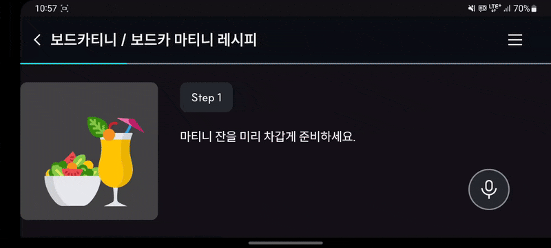
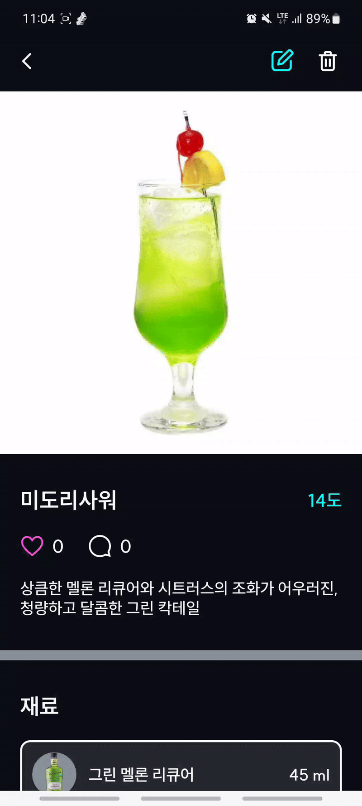
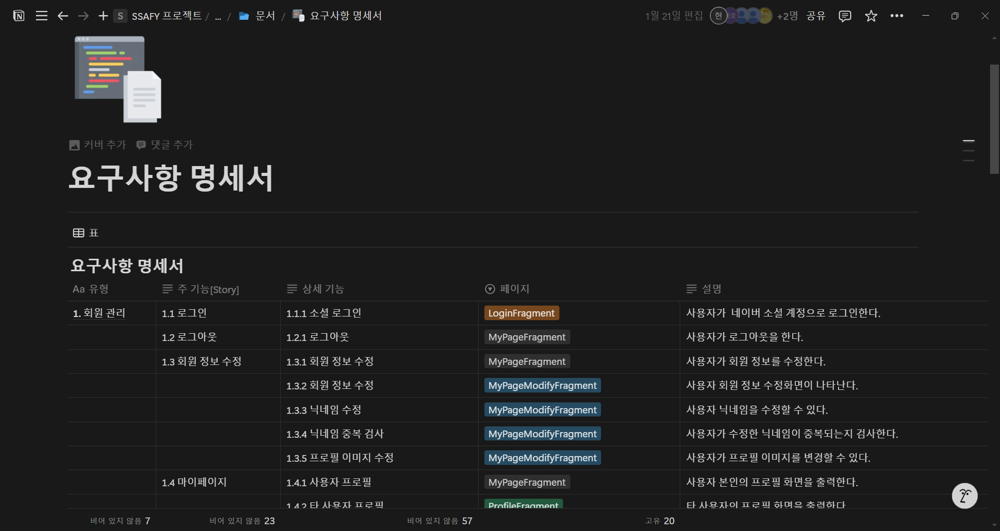
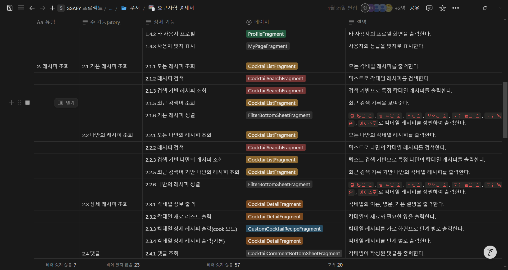
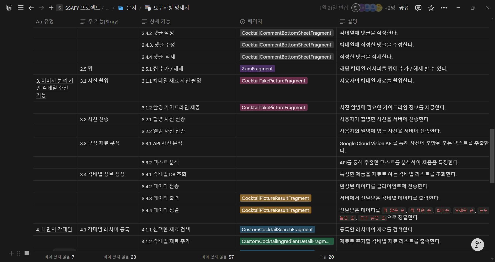
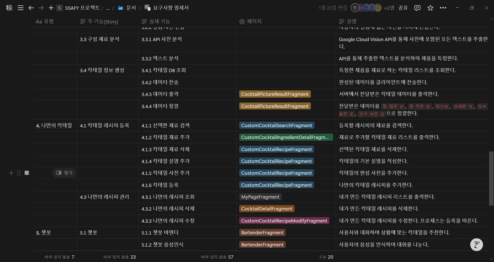
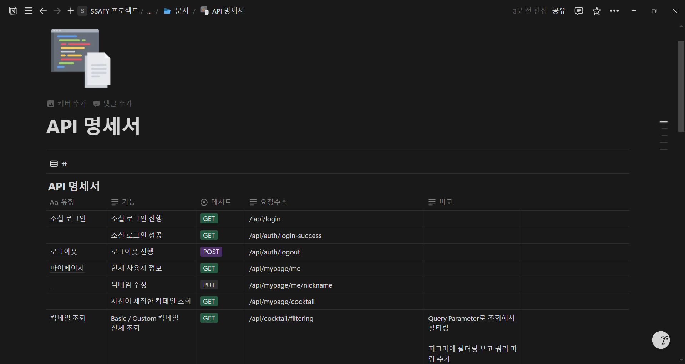
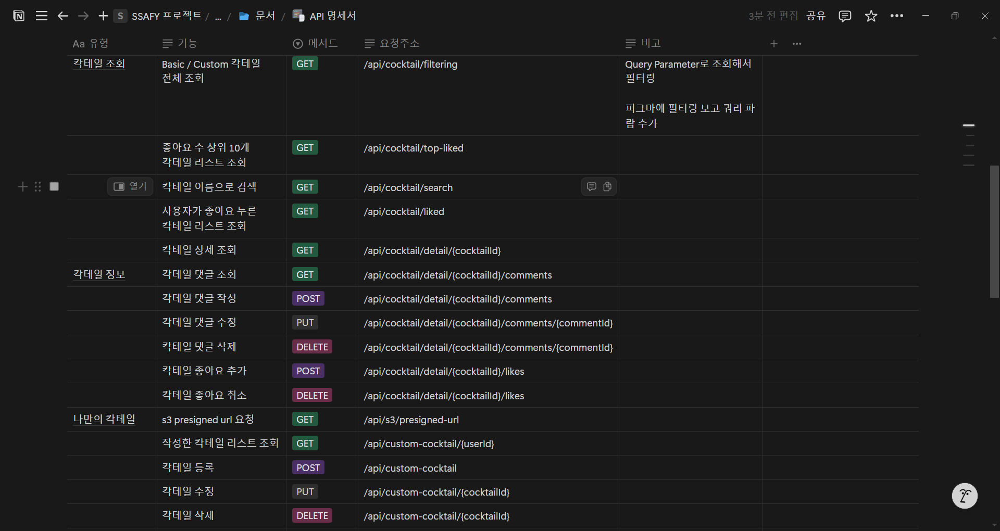
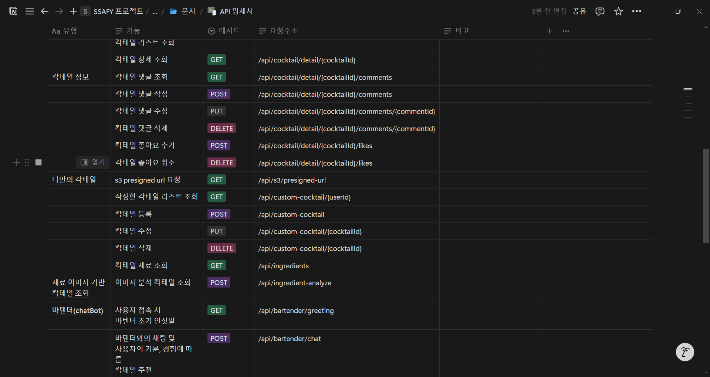
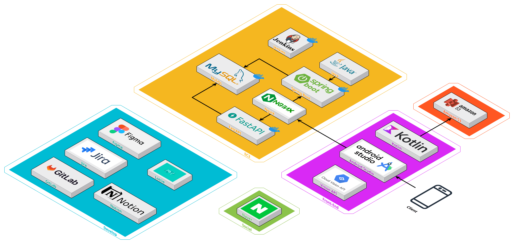

# 🍾 Hontail - 혼(자 마시는) 칵테일
### 모르는 재료로도 쉽게
### 칵테일 정보 공유 어플리케이션


## 📆 프로젝트 진행 기간
### 2025.01.06 ~ 2025.02.21 (7주)


## 📋 프로젝트 소개

**🚩 서비스 한 줄 소개**

```bash
칵테일 정보 공유 어플리케이션
- 사진 촬영을 통해 재료 인식 후 해당 재료로 제작 가능한 칵테일 정보 제공
- 유저들 간의 커스텀 칵테일 정보 공유
```

**🚩 기획 배경**

* 국내 주류시장 규모와 국내 주종별 시장 규모는 시간이 지날수록 커졌습니다.

* 특히 MZ 세대는 기존의 수동적인 음주 문화에서 더 맛있는 술을 마시는 능동적인 음주 문화가 정착되는 것을 파악했습니다.

* 기존의 칵테일 앱은 레시피가 매우 정적이고 사용자 취향 기반의 칵테일을 추천해주지 못한다는 점이 아쉬웠습니다.

**🚩 프로젝트 설명**
* 혼테일은 Gifford's guide 기반의 6,000여 종 이상의 다량의 칵테일 정보를 제공합니다.

* 사용자는 한 번의 사진 촬영만으로 자신이 가지고 있는 주류로 만들 수 있는 칵테일 정보에 대해 알 수 있습니다.

* 사용자는 새로운 칵테일 정보를 추가할 수 있으며, 재료 용량의 단위 및 제작 레시피의 방법 등 다양한 부분에서 커스텀이 가능해 해당 기능을 이용하여 자신만의 특별한 칵테일을 등록 및 공유할 수 있습니다.

* 모든 칵테일에 찜과 댓글을 통해 자신만의 성향을 나타낼 수 있으며, 이러한 사용자 취향 기반 칵테일 추천 기능을 통해 사용자의 입맛에 맞는 새로운 칵테일을 추천받을 수 있습니다.


## 🚀 주요 기능

### 01. 소셜 로그인
- JWT 및 Auth2를 활용한 소셜 로그인


<br>


### 02. 칵테일 재료 인식
- OCR 및 객체 인식 기술을 활용한 칵테일 추천 기능


<br>

### 칵테일 검색 및 필터링
- 텍스트 기반 칵테일 검색과 베이스주, 도수, 찜 개수 등 다양한 조건 기반 필터링 기능


<br>

### 칵테일 상세화면
- 칵테일 이름, 도수, 재료, 레시피 등의 정보를 확인할 수 있는 기능


<br>

### 쿡모드
- 애니메이션과 STT 기술을 통해 시인성과 사용성을 높임


<br>

### 찜
- 개별 칵테일 찜을 통한 취향 기록


<br>

### 바텐더
- AI 바텐더와의 대화를 통한 칵테일 추천 기능


<br>

### 커스텀 칵테일 등록
- 사용자가 원하는 재료 및 레시피를 지정하여 커스텀 칵테일 등록


<br>

### 재료 요청
- 나만의 칵테일 제작 시 존재하지 않는 칵테일 재료 추가를 요청하는 기능


<br>

### 사용자 취향 기반 칵테일 추천
- 사용자 별 칵테일 찜 내역을 기반으로 하여 새로운 칵테일 추천 기능


<br>

## 📃 요구사항 명세서





## 📃 API 명세서





## 📂 ERD


## 🛠️ Architecture


### Back
[](https://skillicons.dev)

### Front
[](https://skillicons.dev)

### Communication
[](https://skillicons.dev)

## 👨‍👩‍👧‍👦 팀원 정보

| 🧑‍💻 **이름**    | 🏆 **역할**        |
|:----------------:|:-----------------:|
| 김두영 | 백엔드 개발, 팀장 |
| 김동현 | 안드로이드 개발 |
| 김성현 | 안드로이드 개발 |
| 김태호 | 백엔드 개발 |
| 안세호 | 백엔드 개발 |
| 윤동욱 | 안드로이드 개발 |

## 🛠 담당 파트

### 안드로이드
- 김동현
    - 소셜 로그인 및 JWT 구현
    - Google Vision API 기반 텍스트추출 기능 구현
    - 칵테일 필터링
    - MVVM 구조 설정
    - 리사이클러뷰 멀티뷰 타입 적용
    
- 김성현
    - 피그마 UI 디자인
    - RecyclerView Multi View Type 리팩토링
    - 커스텀 칵테일 등록 기능 구현
    - 찜 기능 구현
    - 칵테일 댓글 기능 구현
    - 마이페이지 기능 구현
    - 재료 요청 기능 구현현

- 윤동욱
    - 칵테일 상세정보
    - 레시피 요리 모드
    - UI / UX 리팩터링
    - 어플리케이션 애니메이션

### 백엔드
- 김두영
    - 젠킨스 CI/CD 구축
    - AWS EC2 배포
    - 재료 매칭률이 높은 순으로 칵테일 필터링
    - 사용자 취향 기반 칵테일 추천
    - 커스텀 칵테일 등록

- 김태호
    - JWT, Oauth2 기반 소셜 로그인 기능 구현
    - DB 레시피 번역작업

- 안세호
    - 칵테일 필터링 조회 (좋아요 상위, 사용자 좋아요, 이름 검색)
    - 칵테일 상세 조회 및 댓글 CRUD, 좋아요 기능
    - OpenAI 연동 바텐더 챗봇
    - 웹 스크래핑을 통한 DB 구축


## 📌 기타 정보
- API 문서는 👉 [Swagger](https://i12d207.p.ssafy.io/swagger-ui/index.html)를 통해 제공
- Git Flow 전략을 사용하여 개발
- 프로젝트 문서화는 👉 [Notion](https://www.notion.so/SSAFY-D207-17b319ccaace80248febda19baa77e36?pvs=4)
